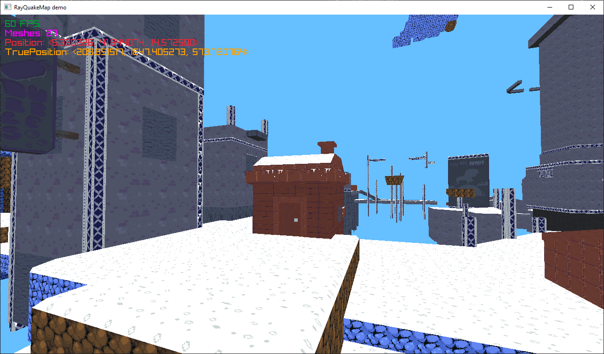

### RayQuakeMap
A small demo that demonstrates loading and rendering Quake maps via Raylib and SledgeFormats.
Note: This just renders the raw geometry and textures/texture-offsets, it doesn't do anything with entity data.

The map and textures are from [Celeste64](https://github.com/EXOK/Celeste64) by Maddy Thorson/Extremely OK Games

